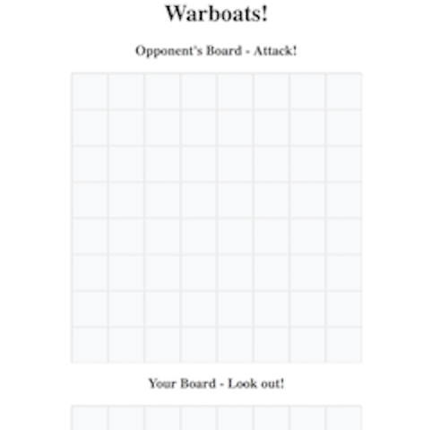

# Technical Requirements
* Display a game in the browser
* Switch turns between two players, or switch turns between a player and the computer(AI)
* Design logic for winning & visually display which player won
* Include separate HTML / CSS / JavaScript files
* Stick with KISS (Keep It Simple Stupid) and DRY (Don't Repeat Yourself) principles
* Use Javascript or JQuery for DOM manipulation
* Deploy your game online, where the rest of the world can access it
* Use semantic markup for HTML and CSS (adhere to best practices)

#Stretch Goals and Pseudocode
* Player vs AI
** Random AI square select
** Random placement of AI ships
** If AI gets hit, next turn select left, right, up, or down from hit
* Drag and drop pieces to choose position
* Hover function to show square selection
* If..then statement for red and white pieces (hit or miss)
* Text div, background and content changes with hits
* Radar animation in background with stop button

# Raw Layout

## Grid Boards 

# Strategies
* Grids are composed of clickable divs, each with unique ID
* Select ships by adding a class to clicked div and use that for opponent to check occupancy
* Also add "filled" class to divs next to or below selected square
* If div contains "filled" class upon opponent selection, mark a hit. Otherwise mark a miss.
* "Helper div" provides instructions, orientation options, and displays hit or miss.
* Algorithm to randomize AI ship placement as well as orientation
* AI selects randomly to hit player ships
* Winner goes to player or computer that reaches 7 hits first.

# Finished Layout

# Challenges 
* Removing event listeners to prevent double clicks
* Adding ship of another size
* AI ship placement randomization

